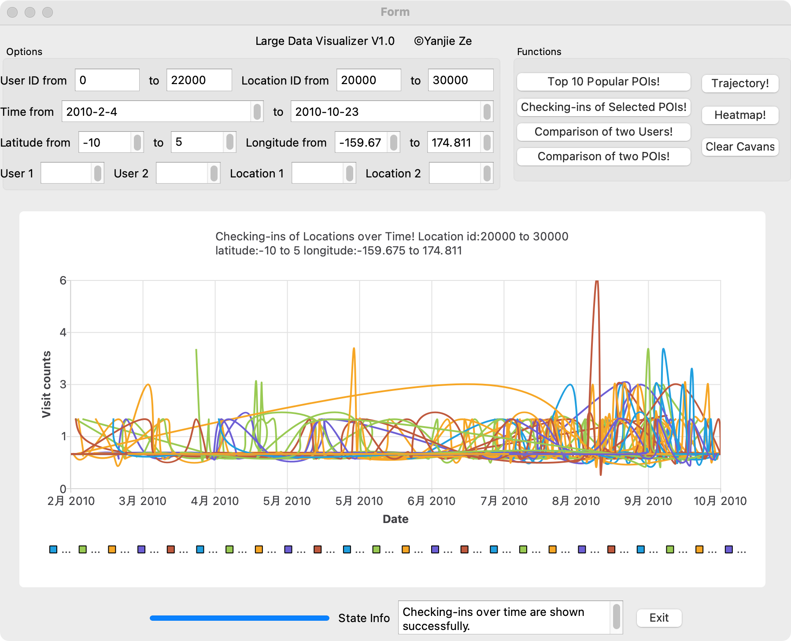
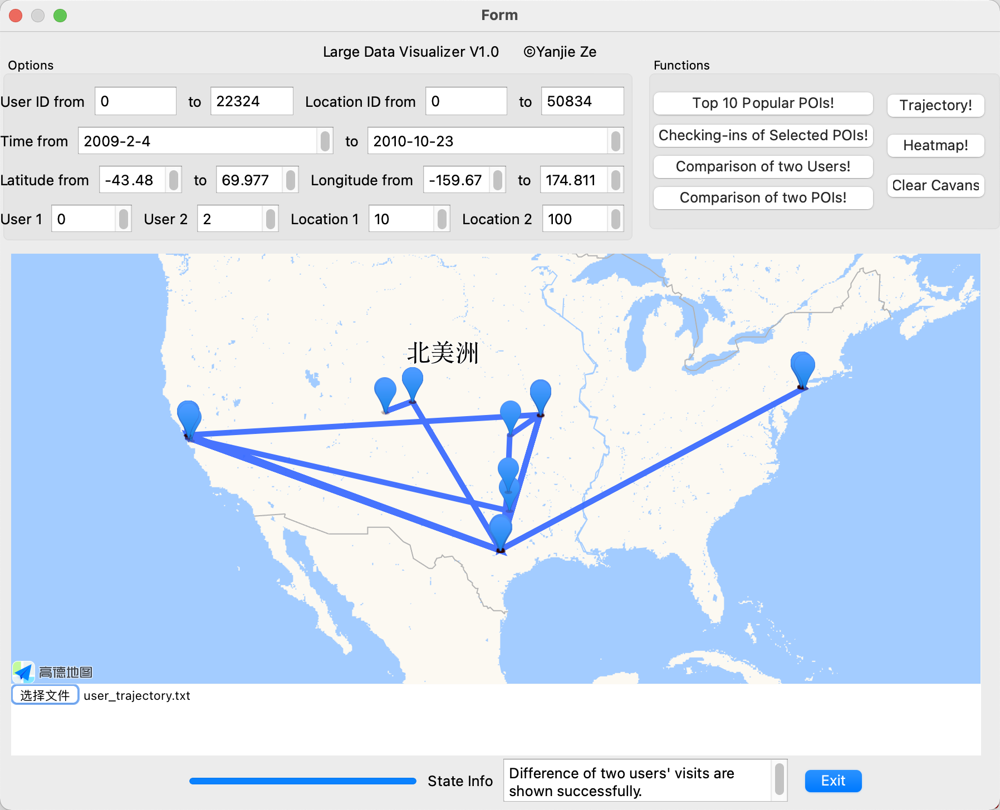
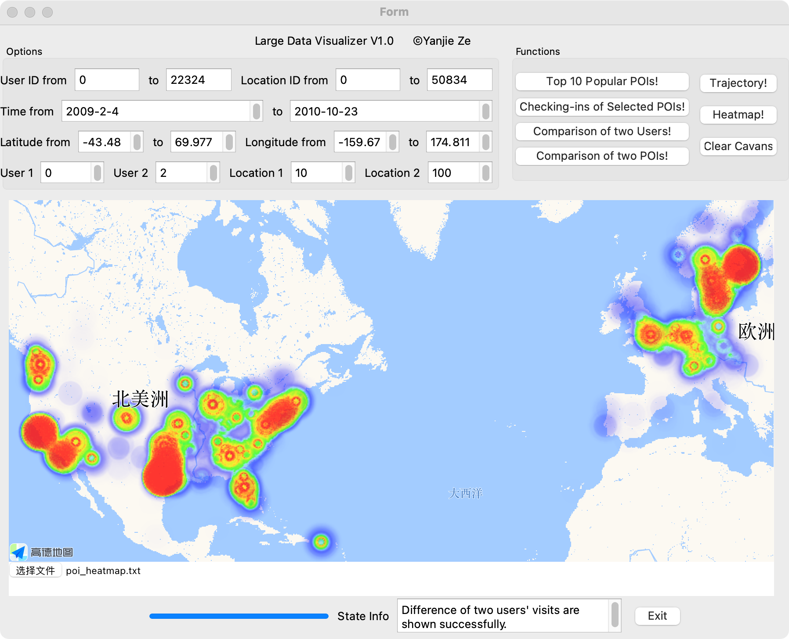

# Large Data Visualizer

[Yanjie Ze](http://yanjieze.com) 

Dec 20, 2021

## 1 Introduction

This is the repo for Course Project of CS2309:  **Principles and Practice of Problem Solving**, taught by  Prof. Jieru Zhao and  Prof. Haiming Jin, mainly finished with **QT, C++, HTML, Javascript**.

In this project, we analyze the POI data provided and visualize it.  Some demos are shown below.

     

 Fig 1. three functions implemented

# 2 Usage

Here we will give instructions on how to run our project.

Preparation:

1. Git clone this repo and open it with QT (5+).
2. Download the data we use, provided in the release, named `gowalla.csv`.
3. Complie and run our application.

Now you can see our GUI, and then:

1. Click `Select Your File` and select the downloaded file.
2. Click `read`.
3. After the reading is finished, you can click several functions provided and try them!

# 3 Functions

We provide six functions:

- **Top 10 Popular POIs!** Display the top 10 popular POIs visited by a specific user (or a set of users) over time.
- **Checking-ins of Selected POIs!** Display the number of checking-ins of a specific POI (or POIs within a GPS range) over time.
- **Comparison of two Users!** Display the difference of visited POIs between two users over time.
- **Comparison of two POIs!** Display the daily active users (DAU) of two POIs.
- **Trajectory!** Display the trajectory of a specific user on the map.
- **Heatmap!** Display the heatmap of popular POIs, i.e., plot the thermal diagram in a period of time on the map.

**Clear Canvas** is used for clear the canvas.

# 4 Acknowledgement

If you get trouble using our code, please feel free to contact the author Yanjie Ze. Email: zeyanjie@sjtu.edu.cn
